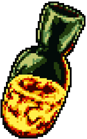

   
   
   
  <samp>Hello there. I'm <b><a href="https://tanx.dev">Tan</a></b>.  I'm a Computer Engineering Undergraduate Student from Mexico. 

</samp>

  

 <b> <samp> Ligth bonefire </samp></b>

<samp>
 <b><h2 style="color: #fc6203">B O N E F I R E &nbsp; L I T !</h2> </b>

Current Project: <a href="https://github.com/TanZng/dijkstras-shortest-path">Dijkstra's shortest path visualizer.</a>

  &nbsp; &nbsp;
  
  &nbsp; &nbsp;
  
  &nbsp; &nbsp;
  
  &nbsp;
  &nbsp;
  

 

</samp>

