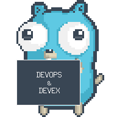

# Hello I'm Tan!
Software Engineer focus on...

  

 <b> <samp> tanx-stack </samp></b>

  

  

  

[DevOps](https://about.gitlab.com/topics/devops/) & [DevEx](https://microsoft.github.io/code-with-engineering-playbook/developer-experience)

